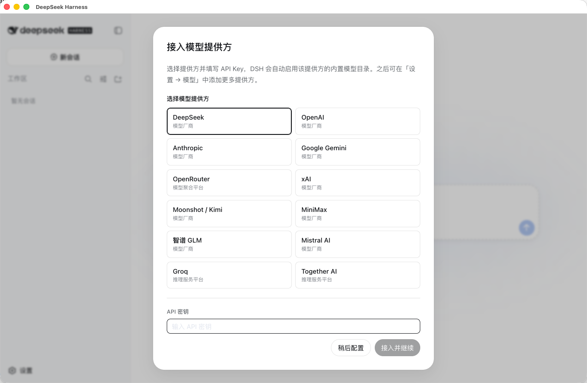

<p align="center">
  
</p>

<h1 align="center">DSH Desktop</h1>

<p align="center">
  A local-first, cross-platform desktop shell for
  <a href="https://github.com/deepseek-ai/deepseek-harness">DeepSeek Harness</a>.
</p>

<p align="center">
  <a href="README.md">English</a> · <a href="README.zh.md">简体中文</a>
</p>

<p align="center">
  <a href="LICENSE"></a>
  
  
</p>

DSH Desktop packages the local DeepSeek Harness web experience as a desktop application. Choose a workspace and the app launches a local Harness instance, manages a random loopback port, persists profiles, plugins, and sessions, and opens the full interface as soon as Harness is ready.

> [!IMPORTANT]
> DSH Desktop is currently an early preview and depends on the rapidly evolving `@deepseek-ai/dsh@0.1.0-rc.6`. Current builds are not code-signed or notarized by Apple and are not recommended for production use.

## Download

| Platform | Package | Download |
| --- | --- | --- |
| macOS Apple Silicon | DMG installer | [Download for Apple Silicon](https://github.com/dataelement/dsh-desktop/releases/latest/download/dsh-desktop-mac-arm64.dmg) |
| macOS Intel | DMG installer | [Download for Intel Mac](https://github.com/dataelement/dsh-desktop/releases/latest/download/dsh-desktop-mac-x64.dmg) |
| Windows x64 | Setup installer | [Download Windows installer](https://github.com/dataelement/dsh-desktop/releases/latest/download/dsh-desktop-windows-x64-setup.exe) |
| Windows x64 | Portable executable | [Download portable version](https://github.com/dataelement/dsh-desktop/releases/latest/download/dsh-desktop-windows-x64-portable.exe) |

All current and historical packages are available on the [GitHub Releases page](https://github.com/dataelement/dsh-desktop/releases).

## Why this project exists

DeepSeek Harness already provides a complete agent runtime and Web UI. DSH Desktop does not reimplement Harness; it supplies the host capabilities needed for a desktop product:

- Run without manually starting a CLI or managing local ports
- Open workspaces with the native system directory picker and remember recent directories
- Manage the Harness child process, readiness checks, logs, and shutdown in one place
- Store profiles, plugins, and sessions outside the application installation directory so upgrades do not remove user data
- Provide packaging entry points for macOS and Windows

## Features

- Opens directly into Harness without an additional landing page
- Prompts for a workspace on first launch and automatically restores the most recent workspace afterward
- Offers retry, workspace switching, log viewing, and exit actions when Harness fails to start
- Provides Workspace menu actions for opening a workspace, selecting a recent workspace, and restarting Harness
- Gracefully terminates the Harness child process when the desktop app exits
- Listens only on a random `127.0.0.1` port for each launch
- Removes Node.js privileges from the renderer and enables `contextIsolation`, sandboxing, and navigation restrictions
- Uses the DSH brand logo consistently in the desktop window and Harness sidebar
- Includes a production DSH app icon in macOS ICNS and Windows ICO formats

## Model providers

During initial setup, you can choose a model provider and enter its API key directly. DSH Desktop uses the real Harness Settings and Credentials APIs: the key is written only to the credential store, the corresponding provider route is created automatically, and its built-in model catalog is inherited without requiring model IDs to be entered manually.

The initial setup currently includes:

| Type | Providers |
| --- | --- |
| Model vendors | DeepSeek, OpenAI, Anthropic, Google Gemini, xAI, Moonshot/Kimi, MiniMax, Zhipu GLM, Mistral AI |
| Model aggregation | OpenRouter |
| Inference platforms | Groq, Together AI |

Additional built-in or custom providers can be added from **Settings → Models** in Harness.

## Quick start

### Requirements

- Node.js 22 or later
- npm
- macOS on Apple Silicon or Intel, or Windows x64

### Local development

```bash
git clone https://github.com/dataelement/dsh-desktop.git
cd dsh-desktop
npm install
npm run dev
```

`npm install` runs `patch-package` to reapply DSH Desktop's model-provider onboarding and sidebar branding, installs the brand asset, and then installs the Electron runtime.

### Quality checks

```bash
npm test
npm run typecheck
npm run build
```

### Packaging

```bash
# Generate unsigned DMG and ZIP artifacts for the current Mac architecture
npm run package:mac

# Run each command on a Mac or CI runner with the matching architecture
npm run package:mac:arm64
npm run package:mac:x64

# Generate NSIS and Portable artifacts on a Windows x64 machine or runner
npm run package:win
```

Harness includes architecture-specific native modules. Dependencies must be reinstalled and built on the matching platform for macOS ARM64, macOS Intel, and Windows x64. The architecture-specific scripts validate the current `platform/arch` before packaging to prevent artifacts that appear successful but are missing native dependencies.

## Runtime architecture

```text
DSH Desktop (Electron Main)
├── Native workspace picker and recent workspaces
├── Harness child-process lifecycle
├── Random loopback port and readiness checks
├── Native logging and recovery actions
└── Hardened BrowserWindow
     └── http://127.0.0.1:<random>  DeepSeek Harness Web UI

Electron userData
├── desktop-settings.json
├── logs/harness.log
└── harness/
    ├── profiles/
    ├── sessions/
    └── Plugins and user data
```

Harness runs in a separate Electron Node child process. The `--expose-internals` permission required by Cordis HMR is granted only to that child process and never to the web renderer.

## Project structure

```text
src/main/             Electron main process, windows, and Harness lifecycle
src/shared/           Shared runtime types
patches/              Reproducible UI customizations for the pinned DSH version
scripts/              Brand-asset installation and target-platform packaging checks
test/                 Settings, runtime, security, and provider coverage tests
build/                Application icon assets
```

## Current validation status

- macOS Apple Silicon: development workflow, real Harness startup, DMG/ZIP packaging, and mounted artifacts verified
- macOS Intel: packaging configuration and platform checks provided; runtime verification still requires an Intel Mac or runner
- Windows x64: NSIS/Portable configuration and platform checks provided; runtime verification still requires a Windows runner
- Windows ARM64: not currently supported
- Code signing, Apple notarization, and automatic updates: not yet integrated

## Upstream version and patches

The project currently pins `@deepseek-ai/dsh@0.1.0-rc.6`. The initial provider list is captured with [`patch-package`](https://github.com/ds300/patch-package) under [`patches/`](patches/) rather than relying on untracked changes in `node_modules`.

When upgrading DSH:

1. Verify the upstream Settings, Credentials, and Provider Directory contracts.
2. Reapply or rewrite the customized onboarding interface.
3. Regenerate the patch.
4. Run regression checks against a real Harness startup and provider configuration flow.

## Contributing

Issues and pull requests are welcome. Before submitting a change, run at least:

```bash
npm test
npm run typecheck
npm run build
```

Never include real API keys in issues, logs, screenshots, or test data.

## License

This project is open source under the [MIT License](LICENSE).

DeepSeek Harness and its dependencies remain subject to their respective upstream licenses and trademark policies. DSH Desktop is an independent community desktop wrapper.
