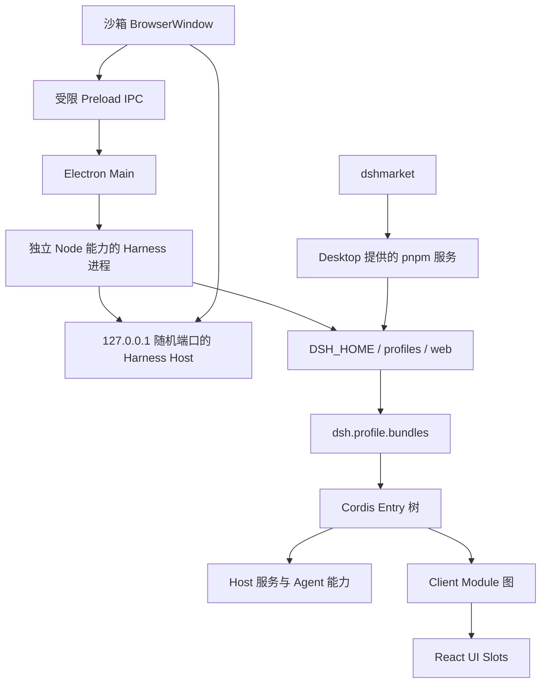
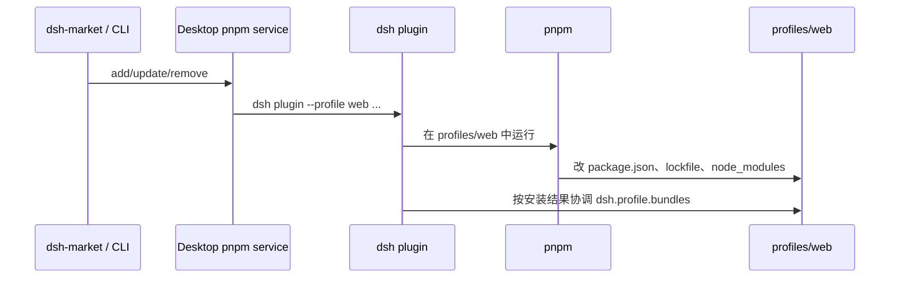
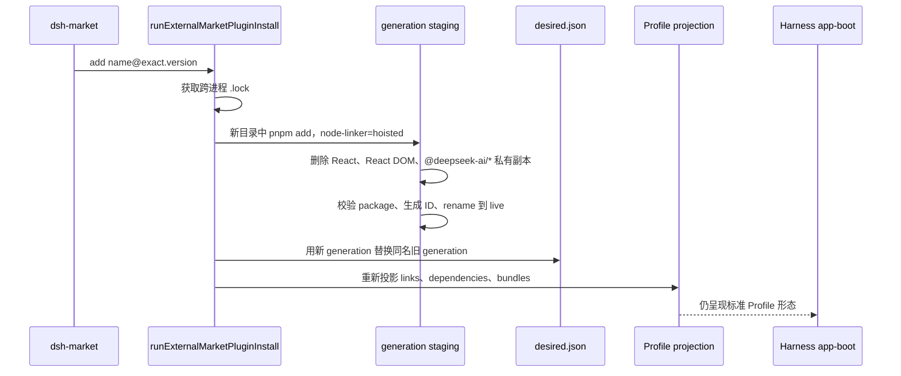

# DSH Desktop 插件管理机制

> 文档基线：`v0.6.3`、`v0.7.0`、`v0.7.1` 与当前源码（2026-08-30）。
>
> 这里的“0.7.0 前”指 `v0.6.3` 及以前的共享 Profile 安装模型；“0.7.0 后”同时覆盖 `v0.7.0` 首版 generation 机制，以及 `v0.7.1` 对自动回滚和卸载生命周期的修正。

## 1. 结论摘要

DSH Desktop 本身不是第二套 Agent Runtime，也没有重新实现 Harness 前端。它是 Electron 宿主，负责启动 DeepSeek Harness、保存 Profile、提供打包好的 Node/pnpm、管理原生窗口与进程生命周期，并在插件导致启动失败时提供修复和安全模式。

DSH 中“插件”至少包含五个不同层级：

1. **npm 包**：代码和依赖的分发单元；普通 npm 依赖不一定是 DSH 插件。
2. **Profile Bundle**：`package.json` 声明 `dsh.bundle.patch` 的包；它向 Profile 提供一层 Cordis 配置。
3. **Cordis Entry**：Bundle 的 `cordis.patch.yml` 中通过 `id`、`name`、`inject`、`config`、`disabled` 描述的实际运行实例。
4. **Client Module**：包声明 `dsh.client` 并导出 `./client` 后，由 Harness 组成浏览器模块图。
5. **UI Slot occupant**：Client Module 通过 `slots.inject()` 和 `slots.register()` 挂到某个 UI 扩展点；Slot 不是安装单元。

因此，插件“已安装”“已加入 Bundle”“Entry 已激活”“前端模块已加载”“UI 已显示”是五个不同状态，不能互相替代。

0.7.0 前，所有社区插件和它们的依赖都安装在 `profiles/web` 的同一个 pnpm 工程和同一棵 `node_modules` 中。一个插件的安装、更新或失败可能改写共享 lockfile、共享依赖和兄弟插件目录。

0.7.0 引入 **immutable generation**：通过插件市场安装的 npm 插件各自在独立目录中完成安装，再以一次 rename 提升为不可变 generation；`desired.json` 保存想启用的 generation 集合，投影器把它们链接回 Harness 仍然认识的 `profiles/web/node_modules`、`dependencies` 和 `dsh.profile.bundles` 形态。它解决的是“共享树原地更新”，尤其是 Windows 上目录被占用时 pnpm rename 卡死的问题，并不隔离插件运行权限或 Cordis/UI 语义冲突。

`v0.7.0` 首版还维护 `last-known-good.json`，启动失败时自动把整个 generation 集合回退。这个策略可能恢复陈旧版本、误伤无关插件，甚至在空快照下清空集合。`v0.7.1` 删除了这类自动回滚：`desired.json` 成为唯一 generation 意图源，插件移除必须来自用户明确选择，并通过持久化 tombstone、备份和下次正常启动验证来完成。

## 2. 技术栈与运行拓扑

### 2.1 主要技术栈

| 层 | 当前技术 | 在插件机制中的职责 |
| --- | --- | --- |
| Desktop Shell | Electron 43.4、TypeScript 5.9、electron-vite 5 | Main/Preload、窗口、IPC、进程启停、更新、安全模式与恢复 |
| Harness Runtime | `@deepseek-ai/dsh@0.1.2-alpha.1` | Profile 初始化、Bundle 解析、Cordis 配置合成、Host 与 Web UI |
| 插件容器 | Cordis 4.0.1 | Entry 生命周期、服务提供与 `inject` 依赖、HMR |
| 前端 | React 18.3、Harness Client Modules、UI Slots | 浏览器插件图、懒加载、UI 扩展与 Slot 冲突检查 |
| 包管理 | pnpm 10.34.5 | Profile 依赖安装、lockfile、旧共享树和新 generation 内部安装 |
| 插件市场 | 可选的社区包 `dshmarket` | 搜索、安装、更新、卸载、热启停、预设与一致性检查 |
| 构建与发布 | npm、electron-builder、patch-package | 打包 Harness 闭包、应用补丁、生成 macOS/Windows 安装物 |

0.7.0 把 Harness 从 `0.1.1-rc.2` 升级到 `0.1.2-alpha.1`。由于当时上游包尚未发布到 npm，仓库把上游 release pipeline 生成的 241 个 DSH 包和 9 个 vendor 包以 tarball 形式纳入 `packages/harness-0.1.2-alpha.1/`，根 `package.json` 使用相对 `file:` 依赖，确保 `npm ci` 可复现。

### 2.2 运行拓扑



macOS 上 Harness 在 Electron `UtilityProcess` 中运行；Windows 上使用应用打包的目标平台 Node.js。浏览器 Renderer 没有 Node 权限。插件的 Host 代码运行在 Harness 进程中，前端代码运行在 Web Renderer 中，两者的依赖图和故障形态不同。

## 3. DSH 对插件的定义

### 3.1 Profile 是组合边界

每个 Profile 位于 `$DSH_HOME/profiles/<name>`。Web Profile 的关键文件是：

```text
profiles/web/
├── package.json          # 依赖声明 + dsh.profile.bundles
├── cordis.patch.yml      # 用户最后一层 patch，可热重载
├── pnpm-workspace.yaml   # hoisted、autoInstallPeers=false
├── pnpm-lock.yaml        # 共享树依赖锁定
└── node_modules/         # 实际包，或 0.7.0 后指向 generation 的链接
```

默认 Web Profile 的官方 Bundle 是：

```json
{
  "dsh": {
    "profile": {
      "bundles": [
        "@deepseek-ai/dsh-base",
        "@deepseek-ai/dsh-web-app"
      ]
    }
  }
}
```

`dependencies` 和 `dsh.profile.bundles` 的语义不同：

- `dependencies` 是包管理与插件市场的安装清单。
- `dsh.profile.bundles` 是有顺序的运行组合清单。
- 包同时出现在两者中，才是 Safe Mode/恢复逻辑可管理的“已配置第三方根插件”。
- 一个依赖如果没有 `dsh.bundle`，只是普通库，不会自动成为运行层。
- 官方 Bundle 从 Desktop/Harness 安装闭包解析，不要求存在于 Profile 的 dependencies。

### 3.2 Bundle 是 Patch Layer

一个包成为 DSH Bundle 的最小声明是：

```json
{
  "name": "example-plugin",
  "dsh": {
    "bundle": {
      "patch": "./cordis.patch.yml"
    }
  }
}
```

Harness 启动时按 `dsh.profile.bundles` 顺序解析每个包的 `dsh.bundle.patch`，从空 Entry 列表开始合成：

```text
官方 base bundle
  → web-app bundle
  → 第三方 bundle 1..N（按清单顺序）
  → Profile 自己的 cordis.patch.yml
  → 启动器 --patch / 参数派生 patch
```

同一个 Entry 的后层配置覆盖前层配置。Bundle 顺序因此是行为和兼容性的一部分，不只是展示顺序。

### 3.3 Cordis Entry 才是实际运行实例

Bundle 的 patch 通常插入一个或多个 Entry：

```yaml
- insert:
    - id: example-plugin
      name: example-plugin
      inject: [settings, webServer]
      config:
        enabled: true
```

- `id` 是组合树中的实例标识。两个 Bundle 插入同一个 ID 会形成 loader 冲突。
- `name` 是要导入的 npm 包。
- `inject` 是硬服务依赖。依赖服务没出现时，Entry 可能一直等待而不是立即抛错，所以用户看到的可能是“启动很慢”。
- `config` 是实例配置。
- `disabled` 控制实例是否激活。

一个 Bundle 可以插入多个 Entry，也可以修改或禁用其他 Bundle 插入的 Entry。这是插件之间影响最强的一层。

### 3.4 Client Module 是浏览器侧插件

需要进入浏览器的包声明：

```json
{
  "dsh": {
    "client": {
      "platform": "web",
      "inject": [
        "@deepseek-ai/dsh-client-ui-settings",
        "@deepseek-ai/dsh-client-ui-slots"
      ]
    }
  },
  "exports": {
    "./client": "./lib/client.js"
  }
}
```

Host 侧扫描已激活 Loader Entry 对应的包，读取 `dsh.client`，构建前端启动图并在 `/plugins` 提供 bundle；浏览器按依赖顺序加载。React、Cordis 和静态 UI 库由宿主提供为共享基座。缺失 provider、循环依赖、重复 graph entry、缺失 `lib/client.js` 或 external 声明漂移，都可能让整棵前端插件树加载失败。

### 3.5 UI Slot 是插件之间的 UI 合约

Client Module 不应直接修改 Harness 页面结构，而是使用 Slot：

```js
ctx.slots.inject('settings.plugins.tab', () =>
  ctx.slots.register(
    { name: 'settings.plugins.tab', key: 'example' },
    ExampleTab
  )
)
```

Slot 的完整关系是：

1. `SlotMap` 只定义 TypeScript 合约。
2. 父组件通过一次 `register(..., { children })` 声明真实子 Slot，决定所有权和生命周期。
3. 插件在声明存在的生命周期内调用 `slots.inject()`。
4. 插件再调用 `slots.register()` 提供 occupant。

Slot 有 `single`、`list`、`keyed`、`chain` 等种类。`single` 只能有一个 occupant；`keyed` 需要唯一 key；父组件被卸载时，子 Slot 的声明和 occupant 也随生命周期撤销。Slot 冲突是 UI 层冲突，不等同于 npm 版本冲突。

## 4. 插件之间的依赖关系与相互影响

| 关系层 | 表达方式 | 典型影响 | 当前管理方式 |
| --- | --- | --- | --- |
| 包依赖 | `dependencies` / `optionalDependencies` | 共享版本被改写、安装失败、磁盘锁、构建脚本 | pnpm lockfile；0.7.0 generation 隔离插件私有闭包 |
| 宿主单例 | `peerDependencies`，React、React DOM、`@deepseek-ai/*` | 第二份 React 会破坏 Hooks；第二套 DSH/Cordis 会分裂服务身份 | generation 安装后无条件删除私有宿主单例，强制向上解析宿主版本 |
| Bundle 组合 | `dsh.profile.bundles` 有序列表 | 后层覆盖前层；缺包或缺 `dsh.bundle` 会启动失败 | Profile 一致性检查；投影器同步清单 |
| Entry 身份 | `id` | 重复 Loader ID；卸载后 patch 仍引用孤儿 Entry | 故障归因扫描 Bundle patch；卸载时精确清理该插件 Entry 行 |
| 服务依赖 | `inject` / `ctx.provide()` | provider 缺失时 Entry 等待；替换后消费者语义变化 | Cordis 生命周期；兼容性检查与 Harness 日志 |
| 前端模块图 | `dsh.client.inject` / `external` | 缺模块、循环、重复 factory、刷新后 404，可能导致整页失败 | Client Modules 图校验；Renderer 错误采集与恢复页 |
| UI Slot | `inject/register`、slot kind/key | single occupant 冲突、key 重复、父 Slot 生命周期结束 | Slot Core 校验；恢复逻辑按 slot 名反查唯一根插件 |
| 用户 Patch | Profile `cordis.patch.yml` | 可禁用官方或其他插件 Entry；卸载后可能留下孤儿配置 | dsh-market 热开关；Desktop 卸载只删除明确属于目标插件的行 |
| 外部系统组件 | 例如 macOS LaunchAgent | npm 包卸载后后台进程仍运行；可影响应用更新和焦点 | 按依赖闭包和绝对可执行路径证明所有权后 bootout + quarantine |

### 4.1 generation 隔离了什么，没有隔离什么

隔离的内容：

- 每个插件自己的安装事务、lockfile 与大部分传递依赖。
- 一个插件更新时，不再原地改写其他插件的目录。
- 安装失败只留下 staging 或未被 `desired` 引用的 generation，不应该污染当前运行集合。

没有隔离的内容：

- 插件仍在同一个 Harness 进程和同一 Cordis Context 体系中运行。
- React、React DOM 和所有 `@deepseek-ai/*` 被刻意作为宿主单例共享。
- Bundle 仍进入同一个有序 Entry 树。
- Client Module 仍进入同一个浏览器模块图。
- UI Slot、服务名、Entry ID 和用户 patch 仍然是共享命名空间。
- generation 不是安全沙箱，也不限制插件访问 Agent 当前权限能访问的数据和系统能力。

## 5. 0.7.0 之前：共享 Profile 树

### 5.1 安装和启动

`dsh plugin --profile web <pnpm args>` 本质上是一个薄 pnpm 转发器：



一次操作成功后，DSH 重新读取 `dependencies`：安装包如果声明 `dsh.bundle` 就追加到 `dsh.profile.bundles`；删除或不再声明 Bundle 的依赖会从 Bundle 清单移除。

Desktop 提供自己打包的 Node/pnpm 和 PATH shim，避免依赖用户机器上的全局 pnpm。正常启动顺序大致为：

```text
显示 splash
→ 停止旧 Harness
→ 固定 pnpm store
→ 清理损坏/临时目录并按 manifest 修复共享树
→ 裁剪确实缺失的 Bundle
→ 报告 Profile 不一致
→ 启动 Harness
```

### 5.2 共享树的主要问题

- 所有直接插件共用 `package.json`、`pnpm-lock.yaml` 和 hoisted `node_modules`。
- 更新一个插件可能升级或降级另一个插件也依赖的包。
- Windows 上 Harness、杀毒软件或索引器持有目录句柄时，pnpm 无法把临时目录 rename 到已有目录；失败可留下 `*_tmp_*` 或 `.dsh-old-*`。
- 安装命令退出 0 只证明包管理完成，不证明 Harness 能启动、Cordis 服务齐全或前端能渲染。
- 修复需要重建整棵共享树，成本和故障面随插件数增长。

安全模式和基于证据的插件恢复在 0.7.0 前已经存在：安全模式使用独立 `desktop-safe-mode` Profile，只含 `@deepseek-ai/dsh-base` 和 `@deepseek-ai/dsh-web-app`，不会读取正常 Profile 的第三方 Bundle 或用户 patch；它共享 session、settings、credentials 和 workspace 数据，因此不是“清空用户数据”。

## 6. 0.7.0：immutable generation

### 6.0 Harness 0.1.2 带来的插件接缝变化

0.7.0 不只是改了插件落盘方式，还借 Harness `0.1.2-alpha.1` 收缩了 Desktop 对上游构建产物的直接修改：

- 上游正式提供 `sidebar.brand.mark`、`sidebar.brand.name`、`conversation.hero.brand.mark` 等 Slot 后，Desktop 品牌从修改编译产物改成 `dsh-desktop-client-ui` Client Module，通过 Slot 注册 occupant。
- `dsh-host-apiproxy` 被上游删除后，预设导入/导出不再寄生在该包的 patch-package 补丁里，改由 `dsh-desktop-preset-transfer` 使用公开的 Connection Fetch Route 接缝注册。
- `dsh-desktop-market-installer`、`dsh-desktop-hmr-fallback` 等 Desktop 自有 Cordis 插件继续由 `build/dsh-desktop.patch.yml` 插入。
- Desktop 自有插件必须同时进入根应用依赖和 `@deepseek-ai/dsh` 的安装闭包；只在 patch 中写 `name` 而没有可解析的包，会让整个 Profile 组合失败。

这体现了当前维护方向：能够通过公开 Bundle、服务或 Slot 完成的能力，应实现为插件；只有宿主窗口、原生 IPC、打包路径和上游尚无扩展点的能力才保留 patch-package 或 Electron Main/Preload 实现。

### 6.1 磁盘布局

```text
$DSH_HOME/profiles/
├── node_modules/                       # Harness 安装闭包，generation 的宿主单例来源
├── .generations/
│   ├── desired.json                    # 当前希望启用的 generation ID
│   ├── live/
│   │   └── <name>+<version>+<lockhash>/
│   │       ├── generation.json
│   │       ├── pnpm-lock.yaml
│   │       └── node_modules/<plugin>/
│   ├── staging/
│   ├── trash/
│   └── .lock                           # 跨进程操作锁
└── web/
    ├── package.json                    # generation 被投影为 link: dependency + bundle
    └── node_modules/<plugin>           # symlink；Windows 使用 junction
```

Generation ID 为 `<安全化包名>+<版本>+<lockfile SHA-256 前 12 位>`。相同版本但解析树不同会得到不同 ID；完全相同的安装结果可以复用已有 generation。

### 6.2 安装流程



投影是派生状态，不是新的 Harness 协议。Harness 仍然只认识：

- `profiles/web/package.json`；
- `dsh.profile.bundles`；
- `profiles/web/node_modules/<plugin>`；
- 插件包自己的 `dsh.bundle.patch`。

当前投影器把 generation 同时写成：

```json
{
  "dependencies": {
    "example-plugin": "link:../.generations/live/.../node_modules/example-plugin"
  },
  "dsh": {
    "profile": {
      "bundles": ["@deepseek-ai/dsh-base", "@deepseek-ai/dsh-web-app", "example-plugin"]
    }
  }
}
```

`link:` 让 dsh-market 仍能通过 dependencies 看见“已安装”，同时避免共享树 repair 尝试下载并覆盖该目录。

### 6.3 宿主单例解析

独立 `pnpm add` 会给未满足的 peer 安装私有副本，包括 React 和大量 `@deepseek-ai/*`。Generation 提升前会无条件删除这些宿主单例。插件代码的真实路径位于 `profiles/.generations/live/...`，Node 的父目录查找最终到达 `profiles/node_modules`，从而复用应用的 React、Cordis 和 Harness 包。

这个选择优先保证“一个宿主、一个 React、一个 Cordis 身份”。代价是：声明了不兼容 Harness peer 范围的插件不会通过携带私有旧版本来工作，而应被兼容性检查识别或由插件升级适配。

### 6.4 旧 Profile 的一次性迁移

升级用户仍然拥有旧共享树，必须迁移才能获得 generation 的收益。当前迁移流程是：

1. 从 manifest 而不是磁盘扫描中识别社区根插件，避免损坏的 `node_modules` 隐藏插件。
2. 在不改动旧 Profile 的前提下，先为所有目标 staging generation，并校验包名、版本、Bundle patch 和宿主 peer。
3. 备份 `node_modules`、`package.json`、`pnpm-lock.yaml` 和迁移前 `desired`。
4. 共享树只保留 `dshmarket`、官方 Bundle 和必须的 Profile 依赖。
5. 写入 `desired`，投影 generation，再重建缩小后的共享树。
6. 标记迁移完成；正常 Profile 首次成功渲染后才删除迁移快照。

预检失败会为相同输入写 deferred fingerprint，后续启动不反复尝试；输入发生变化后才重新迁移。迁移中断或迁移后首次启动失败会恢复完整旧快照。这个回滚是“一次性数据结构迁移的事务回滚”，与 0.7.0 后来删除的“每次插件启动失败都自动回滚 generation 集合”不是一回事。

### 6.5 仍然是混合模型

0.7.0 没有删除共享树：

- 官方 `@deepseek-ai/dsh-base`、`@deepseek-ai/dsh-web-app` 来自应用安装闭包。
- `dshmarket` 自身仍由 Desktop 安装在 Profile 共享树中，因为它是 generation 安装入口。
- dsh-market 1.6+ 的 **精确 npm `add`** 会走 generation boundary。
- 普通 `dsh plugin`、不满足 boundary 形态的源和兼容回退仍可能走旧共享树。
- 启动 repair、`.install-complete` 和 lockfile 仍服务于保留下来的共享部分。

所以“0.7.0 后所有包都完全独立”是不准确的；准确说法是“社区根插件逐步迁移到 generation，Harness 核心、市场自身与兼容路径继续使用共享 Profile 机制”。

## 7. v0.7.0 到 v0.7.1：回滚与卸载语义修正

### 7.1 v0.7.0 首版的自动 generation 回滚

首版有两个指针：

- `desired.json`：用户刚刚要求运行的集合。
- `last-known-good.json`：Harness ready 且窗口渲染后记录的集合。

如果新 `desired` 没有启动到 ready，Desktop 自动把 `desired` 改回 last-known-good 并重启。这个设计把“安装意图”和“自动恢复动作”耦合到整个集合，存在三类风险：

- 一个新插件失败会整体回到旧集合，可能连同无关插件更新一起撤销。
- 陈旧的 last-known-good 可以恢复已经不兼容的旧版本。
- 空或不完整快照可能使整个插件集合消失，随后被冷启动 sweep 物理删除。

### 7.2 v0.7.1：只保留 desired，自动失败不改用户意图

`v0.7.1` 删除 `last-known-good` 读写和启动失败自动 generation 回滚。现在：

- `desired.json` 是唯一 generation 权威。
- 启动失败只进入恢复/安全模式，不自动猜测应该删哪个插件。
- 只有证据能唯一映射到一个已配置第三方根插件时，才提供该插件作为卸载目标。
- 归因不唯一时返回空候选，用户可以查看日志、重试、退出或进入安全模式。

### 7.3 持久化、安全的卸载状态机

`v0.7.1` 增加 `$DSH_HOME/recovery/plugin-removals.json`。ledger 的实际状态与验证字段关系为：

```text
disabled ───────────────→ removed ─→ bootVerifiedAt ─→ backupDeletedAt
    └→ cleanup-pending ─→ 用户重试 ─→ disabled
```

具体流程：

1. 拒绝删除 `@deepseek-ai/*`、官方核心 Bundle 和 `dshmarket`。
2. 写入 durable ledger，先把目标从 `dsh.profile.bundles` 移除。
3. 只保存第一次卸载前的 `package.json`、lockfile、用户 patch，重试不会覆盖原始回滚点。
4. 计算目标根插件的依赖闭包，减去其他直接根插件仍可达的闭包；只处理唯一孤儿组件。
5. macOS 上仅当 LaunchAgent 的绝对 `Program`/`ProgramArguments` 指向唯一孤儿目录时，才 `bootout` 并移入 recovery quarantine。无法证明或无法停止时 fail closed。
6. generation 插件从 `desired` 删除并重新投影；legacy 插件把包目录移入 recovery、编辑 manifest、精确清理该插件 Entry 的用户 patch 行并删除旧 lockfile。
7. 任一步失败都保持插件 disabled，并标为 `cleanup-pending`，后续启动继续执行 tombstone，防止投影把插件加回来。
8. 一次正常 Web Profile 启动成功后记录 `bootVerifiedAt`；后续正常启动才删除恢复备份。Safe Mode 的成功不算正常 Profile 验证。

启动时 tombstone 在 generation 投影前后各执行一次，并在卸载尚未验证时暂停迁移/共享树维护，避免后台 repair 把目标插件复活。

这里对 `dshmarket` 的保护针对通用第三方故障恢复，防止恢复页把管理入口本身当普通候选删除。市场自身仍有独立的 Desktop IPC 卸载流程：先停止 Harness，再使用 workspace-root 语义移除 `dshmarket`，最后由 Desktop 重新启动 Harness。

## 8. 安装、启停、更新、卸载不是同一个动作

| 用户动作 | 改动的状态 | 是否删除文件 | 是否需要重启 |
| --- | --- | --- | --- |
| 安装 generation | 新 live generation、`desired`、Profile 投影 | 否 | Host/Bundle 生效通常需要 Harness 重启；部分前端能力可热装载 |
| 更新 generation | 新 generation 替换同名旧 ID；旧 generation 变成未引用 | 下一次 Harness 停止时 sweep 旧 generation | 通常需要重启验证完整组合 |
| dsh-market 热禁用 | 在 Profile `cordis.patch.yml` 写目标 Entry 的 `disabled: true` | 否 | HMR 可约 1 秒内重组，不等同于卸载 |
| dsh-market 热启用 | 删除 disable 行，或写 `disabled: false` 覆盖低层禁用 | 否 | HMR 可热生效 |
| Safe Mode | 启动独立官方核心 Profile | 否，正常 Profile 完全保留 | 进入/退出需重启 Harness |
| 兼容性临时禁用 | 从正常 Profile Bundle 清单移除 | 否 | 需要正常 Profile 重启 |
| 卸载 | tombstone、备份、清理外部组件、删除 desired 或 legacy 声明/目录 | 延迟且可恢复 | 需要正常 Profile 重启验证 |

这里有两个容易混淆的“启用”：

- generation 在 `desired` 中，表示“这个包应该被投影到 Profile”。
- Cordis Entry 没有被 `disabled`，表示“这个已组合 Bundle 的某个运行实例应该激活”。

插件可以“generation 仍在、Bundle 仍在，但 Entry 被热禁用”；也可以“包仍在磁盘，但不在 desired/Bundles，因此完全不参与组合”。

## 9. 故障检测、归因与恢复

### 9.1 证据来源

Desktop 同时收集：

- Harness 进程 stdout/stderr 和 `harness.log`；
- Runtime phase、ready URL、启动 token；
- Renderer `console-message`、加载失败 DOM、unhandled rejection；
- Profile manifest、lockfile、Bundle patch、运行文件和 UI slot 名；
- `node_modules`/generation 实际磁盘状态。

Renderer 的通用 “Failed to load plugins” 往往早于具体错误，因此恢复检测会短暂轮询晚到的前端证据。一个 Electron Renderer/GPU 进程仍存活，也不证明 Harness 已经完成 Bundle 组合。

### 9.2 从叶子故障映射到根插件

恢复页只能删除直接配置的第三方根插件，而不能把错误中出现的任意包名当卸载目标。归因顺序包括：

1. 错误是否直接命中 `dependencies ∩ bundles` 中的第三方根。
2. 官方/传递叶子包是否由某个根插件的 dependencies、optionalDependencies 或 Bundle patch 唯一拥有。
3. 重复 Loader Entry ID 是否只出现在一个根插件的 Bundle patch。
4. Slot 冲突名是否只被一个根插件代码引用。
5. 如果 Slot 由官方 UI 包提供，再反查哪个第三方根动态引用该 provider 包。

零个或多个所有者都视为归因失败，不提供猜测式批量卸载。诊断日志可以保留官方叶子包名，但删除候选必须是唯一的第三方根。

### 9.3 Safe Mode 的边界

Safe Mode 会在启动隔离 Profile 前停止正常 Harness，因此第三方 Host 与 Client 代码都不会执行。它不是“正常 Harness 少加载几个前端脚本”，也不会删除 session、Agent、模型配置、credentials 或 workspace。

管理页面只列出同时存在于 dependencies 和 bundles 的直接第三方根，排除传递依赖、`@deepseek-ai/*` 与 `dshmarket`。IPC 会校验来源、action 和数组，并把用户提交集合与当前 Profile 再求交集，避免页面数据过期导致越界删除。

## 10. 当前机制的已知边界

以下是当前源码仍然需要显式记住的边界，不应在设计或排障时隐含忽略：

1. **generation boundary 当前专门处理精确 npm `add`。** 普通 `runPlugin` 仍是共享树转发器。任何新增安装入口都必须明确自己更新的是 `desired` 还是共享 manifest，不能只看 pnpm 是否退出 0。
2. **市场的普通社区插件 remove 仍走 `runPlugin(['remove', name])`。** 如果目标是 generation，仅删除 Profile 中的 `link:` 依赖并不等于删除 `desired`；下一次投影可能重新加入。Safe Mode/故障恢复已走正确的 `disableGeneration` 路径，但市场卸载入口也应使用同一权威状态，或扩展一个 generation-aware remove boundary。
3. **兼容性修复中的“只移除 Bundle 行”对 generation 可能不持久。** 下一次 `projectGenerations()` 会按 `desired` 重建 Bundle 清单。若语义是长期禁用，必须同时更新 generation 权威或写入持久化 tombstone。
4. **generation 不是权限沙箱。** 插件仍与 Harness 共享进程能力、用户数据边界和网络/文件能力；插件信任与发布审核是另一条治理链。
5. **宿主 peer 不兼容不会被私有副本掩盖。** 这是保证单例身份的设计选择；需要通过兼容性检查、插件升级或 Safe Mode 处理。
6. **外部组件清理目前只实现 macOS LaunchAgent。** 其他平台或其他类型的 daemon/service 必须先有同等严格的所有权证明和可验证停止协议，不能按包名猜测删除。

## 11. 管理原则

后续修改插件机制时，应保持以下不变量：

1. `dsh.profile.bundles` 是 Harness 启动组合契约；generation registry 必须投影到这个契约，不能要求 Harness 隐式理解 Desktop 私有状态。
2. `desired` 是用户 generation 意图；失败启动不能自动改写它。
3. 包管理退出成功、Harness ready、窗口渲染成功是三个不同的完成条件。
4. 所有 Profile 包操作都必须在 Harness 停止后进行；Windows 文件锁使这个窗口成为正确性要求，不只是性能优化。
5. 卸载必须先禁用、再备份、再证明所有权、再清理；失败时保持 disabled，而不是回滚到可能重新执行故障代码的状态。
6. 不删除无法证明唯一归属的传递依赖、LaunchAgent、配置或用户数据。
7. 用户 patch 是用户资产；只清理明确指向目标包或该包已声明 Entry ID 的行。
8. 恢复候选必须来自唯一证据，不能从“所有已安装插件”做 fallback。
9. Safe Mode 必须是独立 Profile，并在列举/管理正常 Profile 前确保第三方代码未运行。
10. 新的 install/update/remove/enable/disable 入口必须明确修改哪一个权威状态，并覆盖重启后的持久性测试。

## 12. 关键源码索引

- Desktop/Harness 总体结构：[architecture.md](./architecture.md)
- Harness 0.1.2 升级记录：[harness-0.1.2-upgrade.md](./harness-0.1.2-upgrade.md)
- 正常启动、恢复与 Safe Mode 编排：[src/main/index.ts](../src/main/index.ts)
- Harness Profile/Bundle 合约：`@deepseek-ai/dsh-app-boot`，当前安装代码位于 `node_modules/@deepseek-ai/dsh-app-boot/lib/index.js`
- 旧共享 Profile 命令封装：[profile-plugin-command.ts](../src/main/runtime/profile-plugin-command.ts)
- generation 注册表：[registry.mjs](../packages/dsh-desktop-market-installer/generations/registry.mjs)
- generation 安装器：[installer.mjs](../packages/dsh-desktop-market-installer/generations/installer.mjs)
- generation → Profile 投影：[projection.mjs](../packages/dsh-desktop-market-installer/generations/projection.mjs)
- 插件市场与 generation 接缝：[dsh-desktop-market-installer/index.js](../packages/dsh-desktop-market-installer/index.js)
- 旧 Profile 一次性迁移：[generation-migration.ts](../src/main/state/generation-migration.ts)
- 启动前 generation 准备：[generation-launch.ts](../src/main/state/generation-launch.ts)
- durable 卸载 ledger：[plugin-removal.ts](../src/main/state/plugin-removal.ts)
- 第三方根归因与 patch 清理：[plugin-recovery.ts](../src/main/state/plugin-recovery.ts)
- 兼容性检查：[profile-compatibility.ts](../src/main/state/profile-compatibility.ts)
- Safe Mode 隔离 Profile：[safe-mode-profile.ts](../src/main/state/safe-mode-profile.ts)
- 外部组件所有权与清理：[plugin-component-cleanup.ts](../src/main/state/plugin-component-cleanup.ts)
- Desktop 自有 Cordis patch：[dsh-desktop.patch.yml](../build/dsh-desktop.patch.yml)
- Desktop UI Slot 插件：[dsh-desktop-client-ui](../packages/dsh-desktop-client-ui/)
